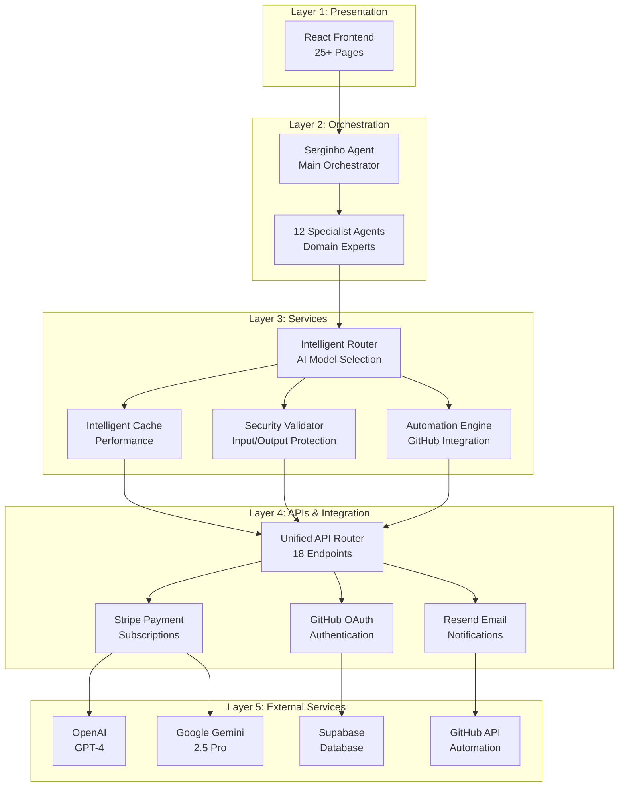

# 🚀 RKMMAX Híbrido - Enterprise AI Agent System

[](https://github.com/kizirianmax/rkmmax-hibrido/actions)
[](https://github.com/kizirianmax/rkmmax-hibrido/actions)
[](https://github.com/kizirianmax/rkmmax-hibrido/actions)
[](LICENSE)
[](package.json)

> ⚠️ **POLÍTICA DE DESENVOLVIMENTO** - Este é um projeto individual desenvolvido por @kizirianmax. Regra absoluta: Todo merge na branch main é feito APENAS com todos os testes passando (CI verde). Veja detalhes completos em [DEVELOPMENT_GUIDELINES.md](DEVELOPMENT_GUIDELINES.md)

**RKMMAX Híbrido** é um sistema empresarial de agentes de IA com arquitetura híbrida (frontend React + backend serverless), featuring um sofisticado sistema de orquestração multi-agente, otimização de custos de IA, e integração completa com pagamentos Stripe.

---

## ⚡ Quick Start (2 minutos)

### 1. Clone & Install
```bash
git clone https://github.com/kizirianmax/rkmmax-hibrido.git
cd rkmmax-hibrido
npm install
```

### 2. Configure Environment
```bash
cp .env.example .env
# Edit .env with your API keys:
# - REACT_APP_OPENAI_API_KEY
# - REACT_APP_GEMINI_API_KEY
# - REACT_APP_SUPABASE_URL & REACT_APP_SUPABASE_ANON_KEY
# - STRIPE_SECRET_KEY (for payments)
```

### 3. Run Development
```bash
npm start              # Frontend (http://localhost:3000)
npm test              # Run test suite (284 tests)
npm test:coverage     # Generate coverage report
```

### 4. Deploy to Vercel
```bash
npm run build         # Build production bundle
vercel deploy         # Deploy to Vercel
```

---

## 🏗️ Architecture Overview

RKMMAX utiliza uma arquitetura de 5 camadas com circuit breaker pattern para resiliência empresarial:



**Arquitetura Chave:**
- 🎯 **Multi-Agent System**: Orquestrador Serginho + 12 agentes especialistas
- 🛡️ **Circuit Breaker**: Proteção contra timeouts serverless (8s timeout)
- 💰 **Cost Optimization**: Roteamento inteligente entre provedores de IA
- 🔒 **Security First**: Validação em múltiplas camadas + audit logging
- 📊 **Observability**: Sentry + PostHog + health checks

Ver [docs/architecture.md](docs/architecture.md) para detalhes completos.

---

## 📚 Core Features

### 🤖 Multi-Agent System
```javascript
// Serginho orchestrates 12 specialist agents
import Serginho from './src/agents/serginho/Serginho.js';

const serginho = new Serginho({
  model: 'gemini-2.0-flash-exp',
  temperature: 0.7
});

const response = await serginho.chat({
  userMessage: "Analyze this repository and suggest improvements",
  context: { repository: "github.com/user/repo" }
});
```

**Available Specialists:**
- 🎨 **UI/UX Designer** - Interface design & user experience
- 🔧 **Full Stack Developer** - Complete application development
- 🧪 **QA Tester** - Testing strategy & quality assurance
- 🚀 **DevOps Engineer** - CI/CD & infrastructure
- 📊 **Data Analyst** - Data analysis & insights
- 🔐 **Security Expert** - Security audits & best practices
- 📱 **Mobile Developer** - Cross-platform mobile apps
- ☁️ **Cloud Architect** - Cloud infrastructure design
- 🤖 **AI/ML Engineer** - Machine learning models
- 🎯 **Product Manager** - Product strategy & roadmap
- 📝 **Technical Writer** - Documentation & technical content
- 🏗️ **System Architect** - System design & architecture

### 🛡️ Circuit Breaker Pattern

Protects against serverless timeouts with automatic failover:

```javascript
import CircuitBreaker from './api/lib/circuit-breaker.js';

const breaker = new CircuitBreaker({
  timeout: 8000,           // 8s timeout (4s margin for 12s Vercel limit)
  failureThreshold: 3,     // Open after 3 failures
  resetTimeout: 60000      // Try recovery after 1 minute
});

const result = await breaker.execute(async () => {
  return await callExternalAPI();
});
```

**3-State Pattern:**
- ✅ **CLOSED**: Normal operation, requests flow through
- ❌ **OPEN**: Circuit tripped, fast-fail without calling service
- 🔄 **HALF_OPEN**: Testing recovery with limited requests

### 💰 Cost Optimization

Intelligent routing across AI providers based on complexity and cost:

```javascript
import { intelligentRouter } from './src/utils/intelligentRouter.js';

const result = await intelligentRouter.route({
  prompt: "Complex analysis task...",
  complexity: "high",
  maxCost: 0.50  // Budget constraint
});

// Automatically selects best provider:
// - Simple tasks → Gemini Flash (fast & cheap)
// - Complex tasks → GPT-4 or Gemini Pro (high quality)
// - Fallback chain for reliability
```

### 🔒 Security & Compliance

Multi-layer security with automatic validation:

```javascript
import { SecurityValidator } from './src/automation/SecurityValidator.js';

const validator = new SecurityValidator();

// Input validation
const validated = await validator.validateInput(userInput);

// Output sanitization
const safe = await validator.sanitizeOutput(aiResponse);

// Audit logging
await validator.logAccess({
  user: userId,
  action: 'chat_request',
  resource: 'ai_model'
});
```

---

## 🌐 API Reference

### Quick API Examples

#### Chat with AI
```bash
curl -X POST https://your-domain.vercel.app/api/chat \
  -H "Content-Type: application/json" \
  -d '{
    "message": "Hello, explain quantum computing",
    "model": "gemini-2.0-flash-exp"
  }'
```

#### Get User Subscription
```bash
curl https://your-domain.vercel.app/api/me-plan \
  -H "Authorization: Bearer YOUR_TOKEN"
```

#### Health Check
```bash
curl https://your-domain.vercel.app/api/health
```

### Available Endpoints

| Endpoint | Method | Purpose |
|----------|--------|---------|
| `/api/chat` | POST | Main chat interface |
| `/api/hybrid` | POST | Hybrid agent orchestration |
| `/api/specialist-chat` | POST | Direct specialist access |
| `/api/ai` | POST | AI service abstraction layer |
| `/api/multimodal` | POST | Multi-modal processing |
| `/api/transcribe` | POST | Audio transcription |
| `/api/vision` | POST | Image analysis |
| `/api/automation` | POST | GitHub automation tasks |
| `/api/security-validator` | POST | Security validation |
| `/api/checkout` | POST | Stripe checkout session |
| `/api/stripe-webhook` | POST | Stripe webhook handler |
| `/api/prices` | GET | Available pricing plans |
| `/api/me-plan` | GET | User subscription status |
| `/api/github-oauth` | GET | GitHub OAuth callback |
| `/api/send-email` | POST | Send notification emails |
| `/api/audit-log` | POST | Activity logging |
| `/api/credit-calculator` | POST | Usage cost calculation |
| `/api/health` | GET | System health check |

Ver [docs/api.md](docs/api.md) para documentação completa da API.

---

## 🚀 Deployment

### Vercel (Recommended)

```bash
# Install Vercel CLI
npm i -g vercel

# Deploy
vercel deploy --prod

# Configure environment variables in Vercel dashboard
```

### Required Environment Variables

```bash
# AI Services
REACT_APP_OPENAI_API_KEY=sk-...
REACT_APP_GEMINI_API_KEY=...
REACT_APP_ANTHROPIC_API_KEY=...

# Database
REACT_APP_SUPABASE_URL=https://...
REACT_APP_SUPABASE_ANON_KEY=...
SUPABASE_SERVICE_ROLE_KEY=...

# Payment
STRIPE_SECRET_KEY=sk_...
STRIPE_PUBLISHABLE_KEY=pk_...
STRIPE_WEBHOOK_SECRET=whsec_...

# Authentication
GITHUB_CLIENT_ID=...
GITHUB_CLIENT_SECRET=...

# Email
RESEND_API_KEY=re_...

# Monitoring (Optional)
REACT_APP_SENTRY_DSN=...
REACT_APP_POSTHOG_KEY=...
```

Ver [docs/deployment.md](docs/deployment.md) para guia completo de deployment.

---

## 🧪 Testing

```bash
npm test                    # Run all tests (284 tests)
npm test:coverage          # Generate coverage report
npm test -- --watch        # Watch mode for development
npm test -- circuit        # Run specific test suite
```

**Test Coverage:**
- ✅ **Circuit Breaker**: 100% coverage, 19 tests
- ✅ **Intelligent Cache**: 100% coverage, 35 tests
- ✅ **Cost Optimization**: 100% coverage, 30 tests
- ✅ **AI Router**: 93% coverage, 45 tests
- ✅ **Automation Engine**: 70% coverage, 42 tests
- ✅ **Security Validator**: 95% coverage, 38 tests
- ✅ **Multi-agent System**: 72% coverage, 75 tests

---

## 📖 Documentation

- **[API Reference](docs/api.md)** - Complete API documentation
- **[Architecture Guide](docs/architecture.md)** - System architecture deep-dive
- **[Deployment Guide](docs/deployment.md)** - Production deployment
- **[Agent System](docs/AGENTS.md)** - Multi-agent orchestration
- **[Observability](docs/OBSERVABILITY.md)** - Monitoring & logging
- **[Development Guidelines](DEVELOPMENT_GUIDELINES.md)** - Contributing guide

---

## 🛠️ Tech Stack

**Frontend:**
- ⚛️ React 18.3.1 with React Router 6.30.3
- 🎨 CSS Modules for styling
- 📊 PostHog & Sentry for analytics

**Backend:**
- 🔥 Vercel Serverless Functions (Node.js 22.x)
- 🗃️ Supabase (PostgreSQL) for database
- 💳 Stripe for payments
- 📧 Resend for transactional emails

**AI Services:**
- 🤖 OpenAI GPT-4, GPT-4 Turbo
- 🧠 Google Gemini 2.0 Flash & 2.5 Pro
- 🔮 Anthropic Claude (optional)

**DevOps:**
- ✅ GitHub Actions CI/CD
- 📦 Jest for testing (284 tests)
- 🔍 ESLint + Prettier for code quality
- 🐛 Sentry for error tracking

---

## 🤝 Contributing

This is an individual project by @kizirianmax. Contributions are welcome but must pass all tests:

1. Fork the repository
2. Create a feature branch (`git checkout -b feature/amazing-feature`)
3. Commit your changes (`git commit -m 'Add amazing feature'`)
4. Ensure all tests pass (`npm test`)
5. Push to the branch (`git push origin feature/amazing-feature`)
6. Open a Pull Request

**Merge Policy:** All PRs require passing CI (green checkmark) before merge.

---

## 📄 License

This project is licensed under the MIT License - see the [LICENSE](LICENSE) file for details.

---

## 👤 Author

**Max Kizirian** ([@kizirianmax](https://github.com/kizirianmax))

---

## 🙏 Acknowledgments

- OpenAI for GPT models
- Google for Gemini models
- Vercel for serverless hosting
- Supabase for database infrastructure
- Stripe for payment processing

---

## 📊 Project Stats

- 📦 1,719 npm packages
- 📝 284 passing tests
- 📈 24% code coverage (growing)
- 🚀 18 API endpoints
- 🤖 13 AI agents (1 orchestrator + 12 specialists)
- 📄 25+ React pages
- ⚡ Sub-second response times with caching

---

**Built with ❤️ by the RKMMAX Team**