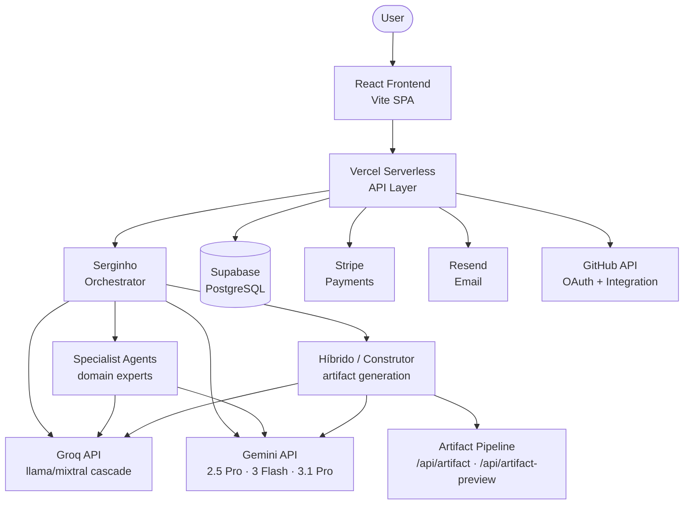

[](https://github.com/kizirianmax/rkmmax-hibrido/actions/workflows/test.yml)
[](LICENSE)
[](.nvmrc)
[](https://coderabbit.ai/gh/kizirianmax/rkmmax-hibrido)

# RKMMAX Híbrido

RKMMAX Híbrido is an AI agent orchestration system with a React frontend and Vercel serverless backend. The orchestrator (Serginho) is sovereign and routes requests across a multi-provider setup currently in stabilization — Groq and Gemini are both active in the codebase, with provider priority defined by `src/config/modelPriority.js`.

### Em uma frase

**RKMMAX / Serginho IA** é um sistema de orquestração de IA com um orquestrador soberano (Serginho), 47 especialistas de domínio, uma camada de geração/validação/exportação de artefatos (Construtor/Híbrido) e uma camada de conformidade ABNT — projetado para reduzir o esforço de produzir entregáveis estruturados (não apenas respostas de chat) com rastreabilidade arquitetural.

- **Problema que endereça:** quando se usa IA para gerar entregáveis (documentos, pacotes, conteúdo estruturado), a saída tende a ser texto solto, sem validação, sem ciclo de revisão e sem auditoria. O Construtor/Híbrido encapsula geração → validação → preview → revisão → aprovação → exportação dentro de um único pipeline, sob orquestração soberana do Serginho.
- **Público-alvo inicial (ICP):** estudantes, pesquisadores e profissionais que precisam de entregáveis estruturados (com viés inicial para conformidade ABNT) e avaliadores técnicos de banca/incubadora que precisam inspecionar a arquitetura e o baseline reproduzível.
- **O que diferencia:** Serginho é o ponto de entrada único — não há bypass do orquestrador; o Construtor entrega artefatos empacotados com manifest e UUID, não apenas mensagens; especialistas e ABNT são camadas separadas e auditáveis.
- **Dossiê externo para avaliadores (F8-OBS-03):** [`docs/audits/f8-obs-03-dossie-externo-incubadoras-editais-2026-05-30.md`](docs/audits/f8-obs-03-dossie-externo-incubadoras-editais-2026-05-30.md)

> **Development policy:** This is an individual project by [@kizirianmax](https://github.com/kizirianmax). All merges to `main` require a passing CI run. See [docs/DEVELOPMENT_GUIDELINES.md](docs/DEVELOPMENT_GUIDELINES.md) for details.

---

## Architecture Overview

The system is structured in three layers:

| Layer | Component | Role |
|-------|-----------|------|
| **Orchestration** | Serginho | Sovereign orchestrator — routes requests, maintains context, delegates to specialists |
| **Domain expertise** | Specialist Agents | 47 domain specialists across 9 categories, each with a focused capability set |
| **Artifact generation** | Híbrido / Construtor | Handles artifact construction, hybrid chat, and multi-step generation tasks |

**AI providers (multi-provider, in stabilization):** The orchestrator uses a provider priority order defined as the single source of truth in `src/config/modelPriority.js`. At the time of writing the automatic order is: Gemini 3 Flash → Gemini 3.1 Pro → Gemini 2.5 Pro → Groq 70B → Groq 120B. Serginho remains the sovereign orchestrator; all provider calls go through it.


```mermaid
graph TD
    User([User]) --> Frontend[React Frontend<br/>Vite SPA]
    Frontend --> API[Vercel Serverless<br/>API Layer]

    API --> Serginho[Serginho<br/>Orchestrator]
    Serginho --> Specialists[Specialist Agents<br/>domain experts]
    Serginho --> Hibrido[Híbrido / Construtor<br/>artifact generation]

    Serginho --> Groq[Groq API<br/>llama/mixtral cascade]
    Serginho --> Gemini[Gemini API<br/>2.5 Pro · 3 Flash · 3.1 Pro]
    Specialists --> Groq
    Specialists --> Gemini
    Hibrido --> Groq
    Hibrido --> Gemini
    Hibrido --> ArtifactPipeline[Artifact Pipeline<br/>/api/artifact · /api/artifact-preview]

    API --> Supabase[(Supabase<br/>PostgreSQL)]
    API --> Stripe[Stripe<br/>Payments]
    API --> Resend[Resend<br/>Email]
    API --> GitHub[GitHub API<br/>OAuth + Integration]
```

**Cross-cutting concerns:**
- **Circuit Breaker** — protects against serverless timeout cascades (8 s hard limit, 4 s margin within Vercel's 12 s cap)
- **Security validation** — input sanitization and output filtering on every AI call
- **Intelligent cache** — reduces redundant provider calls for repeated prompts
- **Observability** — Sentry (errors) + PostHog (analytics) + `/api/health` endpoint

For a detailed architectural breakdown, see [docs/architecture.md](docs/architecture.md).

---

## Construtor/Híbrido — Artifact Pipeline

> **Nota de governança (2026-05-24):** A Fase 2 do Híbrido/Construtor foi encerrada estruturalmente após auditoria objetiva e a **Fase 3 (qualidade/estabilização)** está oficialmente aberta em trilha documental, sem alterações funcionais nesta etapa.

The Híbrido / Construtor layer is **not a chatbot**. It is a generation, validation, preview, and export pipeline that produces structured artefacts from AI-generated content.

### Pipeline

```
gerar → empacotar → validar → preview observacional → revisar → aprovar → exportar
```

| Step | Endpoint | Description |
|------|----------|-------------|
| **Gerar** | `POST /api/ai` (`agentType: "hybrid"`) | Serginho routes the request to the Construtor, which generates the content under sovereign orchestration |
| **Empacotar** | `POST /api/artifact` | Wraps the generated content in a ZIP with a UUID, manifest, and logs |
| **Validar + preview observacional** | `POST /api/artifact-preview` | Runs structural validation and returns a preview report with `summary`, `decision`, `feedback` and `summary.execution.reason = "execution-disabled-by-security-policy"`; `executeArtifact` is not invoked and there is no real sandboxed execution in this stage |
| **Revisar** | *(client)* | The preview result is displayed to the user with a suggested decision |
| **Aprovar + exportar** | `PATCH /api/artifact-preview` | Applies `decision: "approved" | "rejected"`; when approved and `content` is supplied, returns `zipBase64` for export |

### Por que não é apenas um chat

- The Construtor/Híbrido is an **artefact generation and validation layer**, not a chatbot — it produces a structured deliverable with every request.
- It outputs **packaged artefacts** (ZIP with UUID and manifest) that can be exported and audited; current preview metadata is observational only and must not be presented as functional runtime evidence.
- There is a **review and approval cycle** (`approved | rejected`) with a `decisionTimestamp` field recorded in the preview object for traceability.
- Generated content passes through **structural validation** before it is delivered to the user.
- The entire layer operates **under Serginho's sovereign orchestration** — no call to `/api/artifact` or `/api/artifact-preview` bypasses the orchestrator.

### Arquivos-fonte

| Arquivo | Responsabilidade |
|---------|-----------------|
| [`api/artifact.js`](api/artifact.js) | Endpoint `POST /api/artifact` — empacota conteúdo gerado em ZIP com UUID, manifest e logs |
| [`api/artifact-preview.js`](api/artifact-preview.js) | Endpoint `POST/PATCH /api/artifact-preview` (validar/preview sem execução real; aprovar/rejeitar/exportar) |
| [`src/lib/construtor/artifactPackager.js`](src/lib/construtor/artifactPackager.js) | Empacotamento — gera ZIP base64 com manifest e UUID |
| [`src/lib/construtor/artifactNormalizer.js`](src/lib/construtor/artifactNormalizer.js) | Normalização — extrai e limpa o conteúdo visível do artefato |
| [`src/lib/construtor/artifactValidator.js`](src/lib/construtor/artifactValidator.js) | Validação estrutural do artefato antes da entrega |
| [`src/lib/construtor/artifactRunner.js`](src/lib/construtor/artifactRunner.js) | Módulo de execução existente, mas não invocado pelo handler atual; `executeArtifact` permanece desativado |
| [`src/lib/construtor/artifactPreview.js`](src/lib/construtor/artifactPreview.js) | Orquestração do ciclo de preview (validar → sumarizar), preservando marcador explícito de execução desativada |
| [`src/pages/HybridAgentSimple.jsx`](src/pages/HybridAgentSimple.jsx) | Interface React do Construtor — gerencia ciclo de geração, revisão e exportação |
| [`src/components/construtor/ArtifactPreviewPanel.jsx`](src/components/construtor/ArtifactPreviewPanel.jsx) | Painel de revisão — exibe preview, decisão (aprovar/rejeitar) e download do ZIP |

---

## Specialist Agents

The system registers **47 domain specialists** across 9 categories. The canonical source of truth is `src/config/specialists.js`, which is the only file read by both the backend (`api/ai.js`) and the frontend at runtime.

| Category | Specialists |
|----------|-------------|
| `business` | Biz, Cash, Sales, Mark, Law, PM, HR |
| `creative` | Orac, Zen, Vox, Art, Beat, Film, Lens, Write, Game |
| `education` | Didak, Edu, Mentor |
| `engineering` | Mech, Elec, Civil |
| `languages` | Poly, Eng, Span |
| `lifestyle` | Trip, Home, Style, Eco, Med |
| `science` | Bio, Chem, Phys, Math, Astro |
| `tech` | Code, Nexus, Synth, Sec, Data, UX, Mobile |
| `wellness` | Emo, Focus, Fit, Chef, Coach |

> **Note:** `src/agents/specialists/specialists-config.json` is a legacy stub kept for historical reference and is not imported by any active code path.

---

## Tech Stack

| Layer | Technology |
|-------|-----------|
| Frontend | React 18.3.1, Vite, React Router |
| Backend | Vercel Serverless Functions, Node.js 22.x |
| AI | Multi-provider (Groq + Gemini) — priority in `src/config/modelPriority.js`, orchestrated by Serginho |
| Database | Supabase (PostgreSQL) |
| Payments | Stripe |
| Email | Resend |
| Auth | GitHub OAuth |
| CI/CD | GitHub Actions + Jest |
| Observability | Sentry, PostHog |

---

## Quick Start

### 1. Clone & install

```bash
git clone https://github.com/kizirianmax/rkmmax-hibrido.git
cd rkmmax-hibrido
npm install
```

### 2. Configure environment

```bash
cp .env.example .env
```

Use [.env.example](.env.example) as the single source of truth for all variables. Mandatory keys are listed in the `🔴 CRÍTICAS` section.

### 3. Run locally

```bash
npm start                  # Frontend dev server (http://localhost:5173)
```

To test serverless functions locally, use the Vercel CLI:

```bash
npm i -g vercel
vercel dev                 # Runs frontend + API functions together
```

### 4. Build & deploy

```bash
npm run build              # Production build (Vite)
vercel deploy --prod       # Deploy to Vercel
```

---

## API Endpoints

All endpoints are Vercel serverless functions under `/api/`.

| Endpoint | Method | Purpose |
|----------|--------|---------|
| `/api/health` | GET | System health check |
| `/api/chat` | POST | Main chat interface |
| `/api/ai` | POST | AI abstraction layer (Construtor: `agentType: "hybrid"`, Serginho: `type: "genius"`, Specialists: `type: "specialist"`) |
| `/api/transcribe` | POST | Audio transcription |
| `/api/abnt-extract-url` | POST | ABNT document extraction |
| `/api/study-lab` | POST | Study lab features |
| `/api/checkout` | POST | Stripe checkout session |
| `/api/stripe-webhook` | POST | Stripe webhook handler |
| `/api/github-oauth` | GET | GitHub OAuth callback |
| `/api/github` | GET/POST | GitHub API integration |
| `/api/admin` | POST | Admin operations |
| `/api/artifact` | POST | Packages generated content into a ZIP (base64) with manifest and UUID — called after `/api/ai` |
| `/api/artifact-preview` | POST/PATCH | Observational preview and review/export flow: `POST` validates and returns a summary with suggested decision; `PATCH` applies `approved`/`rejected` and may return `zipBase64` for export; `executeArtifact` remains disabled |
| `/api/artifact-ledger` | GET | Observational/read-only Artifact Ledger query by `artifactId` |
| `/api/artifact-provenance` | GET | Observational/read-only provenance by `artifactId` |
| `/api/artifact-replay` | GET | Observational/read-only replay by `artifactId`; not functional restoration or time-travel |
| `/api/artifact-replay-diff` | GET | Observational/read-only diff/verdict by `artifactId`; not Git history or full versioning |
| `/api/artifact-trace` | GET | Observational/read-only query by `traceId`; not global user tracking |

See [docs/api.md](docs/api.md) for complete request/response documentation.

---

## Deployment

RKMMAX Híbrido is designed for Vercel. All serverless functions in `api/` are automatically deployed as Vercel Functions.

### Environment variables (Vercel dashboard)

```bash
# Production-specific examples
GITHUB_OAUTH_REDIRECT_URI=https://your-domain/api/auth/github/callback
FROM_EMAIL=noreply@your-domain
REACT_APP_SENTRY_DSN=...
REACT_APP_POSTHOG_KEY=...
```

All variables are documented in [.env.example](.env.example). See [docs/deployment.md](docs/deployment.md) for a step-by-step guide.

**Production domain:** https://kizirianmax.site  
**Health check:** `curl https://kizirianmax.site/api/health` — returns `{"status":"ok",...}` when the system is up

---

## Testing

```bash
npm test                   # Run all tests
npm run test:coverage      # Generate coverage report
npm test -- --watch        # Watch mode for development
npm test -- circuit        # Target a specific test suite
```

The test suite covers: circuit breaker, intelligent cache, AI router, security validator, multi-agent system, and cost optimization logic. Run `npm test` to see the current pass count and coverage, which may change as the test suite evolves.

---

## Project Structure

```
rkmmax-hibrido/
├── api/                    # Vercel serverless functions
│   ├── __tests__/          # API-level tests
│   ├── _utils/             # Shared utilities
│   └── lib/                # Circuit breaker, orchestrator, providers
├── src/                    # React application (Vite)
│   ├── agents/             # Agent infrastructure and specialist configs
│   │   ├── core/           # AgentBase, SpecialistFactory, registry
│   │   └── specialists/    # specialists-config.json
│   ├── components/         # Reusable React components
│   ├── pages/              # Page-level components (35 routes)
│   ├── services/           # Frontend service layer
│   └── utils/              # Utility functions
├── docs/                   # Extended documentation
├── public/                 # Static assets
├── .env.example            # Environment variable reference
├── vercel.json             # Vercel deployment configuration
└── vite.config.js          # Vite build configuration
```

---

## Documentation

- [docs/README.md](docs/README.md) — Documentation index
- [docs/architecture.md](docs/architecture.md) — Architecture deep-dive
- [docs/api.md](docs/api.md) — API reference
- [docs/deployment.md](docs/deployment.md) — Deployment guide
- [docs/AGENTS.md](docs/AGENTS.md) — Agent system details
- [docs/OBSERVABILITY.md](docs/OBSERVABILITY.md) — Monitoring and logging
- [docs/DEVELOPMENT_GUIDELINES.md](docs/DEVELOPMENT_GUIDELINES.md) — Governance and contribution rules

---

## Architecture Principles

- **Multi-provider runtime (in stabilization):** Groq and Gemini are both active AI providers at runtime. Provider priority is defined as the single source of truth in `src/config/modelPriority.js`. Serginho remains the sovereign orchestrator — all provider calls flow through it. Consolidation and coherence review of provider usage across layers (Híbrido/Construtor in particular) is pending and tracked as an open observation.
- **CI-green merges only:** No PR is merged to `main` without a passing CI run. This is a hard rule enforced by convention; branch protection rules require GitHub Pro or a public repository and are not currently active on this private repository.
- **Single-owner governance:** This is an individual project. External contributions are welcome but must pass all tests and comply with [docs/DEVELOPMENT_GUIDELINES.md](docs/DEVELOPMENT_GUIDELINES.md).
- **Serverless-first resilience:** The circuit breaker pattern is the primary mechanism for handling downstream failures within Vercel's timeout constraints.
- **Legacy repo consolidation:** The architecture is fully consolidated in `rkmmax-hibrido`. Legacy repositories (`kizirian-max-site`, `Rkmmax-app`, `kizi-agent`, `rkmmax-specialists`) have been audited and are no longer active structural sources. `kizi-agent` was an original prototype; `rkmmax-specialists` was a standalone dataset snapshot (49 specialists, superseded by the 47-specialist canonical set in `src/config/specialists.js`). Both are formally classified as discontinued, with no structural dependency in the current system.
- **Active parallel deployment — ABNT layer:** The repository `formatador-abnt` (deployed at `abnt.kizirianmax.site`) is **not** classified as discontinued. It is an independent, actively deployed standalone version of the ABNT conformance layer, running its own stack (Express + Vite + TypeScript). It retains two features not yet fully ported to `rkmmax-hibrido`: (1) a reference validator with ABNT compliance scoring, and (2) project-based organisation of the reference library. It should be preserved until those features are either absorbed into the main codebase or explicitly deprecated.

---

## Estado atual do produto

Esta seção separa, sem inflação, o que já é verificável hoje do que ainda é limite ou trabalho futuro. Serve como leitura rápida para avaliadores.

### ✅ Pronto / verificável

- Orquestrador soberano **Serginho** ativo — ponto de entrada arquitetural para as chamadas de IA, sem bypass intencional do orquestrador.
- Pipeline do **Construtor/Híbrido**: `gerar → empacotar → validar → preview observacional → revisar → aprovar → exportar` (endpoints `POST /api/ai`, `POST /api/artifact`, `POST /api/artifact-preview`, `PATCH /api/artifact-preview`), com `executeArtifact` desativado e sem execução sandboxed real nesta etapa.
- Catálogo de **47 especialistas** com fonte única de verdade em `src/config/specialists.js`.
- Camada **ABNT** (validação/conformidade) como camada separada e auditável.
- Baseline reproduzível: `npm run lint`, `npm run build`, `npm test -- --runInBand` documentado e executável localmente.
- **Demo pública estática** (rotas `/demo`, `/demo-autoplay`, `/startup`, `/showcase`) — sem autenticação e sem geração ao vivo durante a apresentação.
- **Circuit breaker**, **cache inteligente** e **validação de segurança** ativos no caminho serverless (ver `api/lib/`).
- Endpoint de saúde público: `GET /api/health`.
- Endpoints observacionais já existentes para Artifact Ledger, proveniência, replay, diff e consulta por `traceId`, todos documentados em [docs/api.md](docs/api.md) como leitura observacional sem decisão de runtime.

### 🟡 Em estabilização

- **Multi-provider Groq + Gemini.** Ambos estão ativos no código; a prioridade é definida em `src/config/modelPriority.js` como fonte única. A consolidação ainda pendente é a revisão de coerência sobre qual provider/modelo é efetivamente usado em cada caminho de chamada das camadas (em particular dentro do Híbrido/Construtor), garantindo que o `modelPriority.js` seja respeitado uniformemente — observação aberta, não bloqueante.
- **Cobertura de testes JSX** ampliada na Fase 5 (F5-02); ainda há dívida pré-existente de warnings de lint (rastreada, não bloqueante).
- **Documentação canônica** após F6-DOC-01 — stubs de compatibilidade mantidos para referências antigas (`docs/API.md`, `docs/ARCHITECTURE.md`).

### ⛔ Futuro / não prometido nesta versão

- **Não há IA em tempo real nas rotas de demo pública** — a demo opera sobre fixtures estáticas (`src/data/demoArtifacts.js`); ver [docs/DEMO.md](docs/DEMO.md).
- **`executeArtifact` está desativado por decisão de segurança** — execução de artefatos JS gerados não está habilitada no runtime atual; não há sandbox real nesta etapa e preview não deve ser apresentado como execução funcional real.
- **Sem dashboard de métricas externo**, sem analytics próprio fora de Sentry/PostHog, sem persistência adicional além do Supabase já documentado.
- **Branch protection** não está ativa neste repositório privado (limitação do plano GitHub); a regra de "CI verde" é enforced por convenção.
- Itens **F5-04 (governança de sandbox)** e **F5-05 (métricas não voláteis)** são explicitamente futuros e não bloqueantes para a banca.
- F14 prepara consumo visual observacional futuro de Ledger/proveniência/replay/diff/traceId, mas não implementa UI funcional nesta etapa.
- Não há garantia documental de SLA, segurança absoluta, clientes, receita ou tração.

---

## Para avaliadores / banca

Leitura rápida para avaliadores técnicos, banca e incubadora. Tudo abaixo é verificável diretamente no repositório.

### Demo pública

- Vitrine pública (estática, sem autenticação): rotas `/demo`, `/demo-autoplay`, `/startup`, `/showcase`.
- Detalhamento de escopo e transparência da demo: [docs/DEMO.md](docs/DEMO.md).
- Checklist operacional para reprodução da demonstração: [docs/audits/f5-03-checklist-operacional-demo-2026-05-25.md](docs/audits/f5-03-checklist-operacional-demo-2026-05-25.md).
- A demo **não** promete IA em tempo real — opera sobre fixtures estáticas documentadas.

### Baseline técnico (reproduzível)

Executável localmente após `npm install`:

```bash
npm run lint               # ESLint sobre src/ e api/
npm run build              # Build de produção (Vite)
npm test -- --runInBand    # Suíte Jest completa, execução serial
```

Resultado de baseline registrado nas auditorias de Fase 5 (ver `CHECKLIST.md`):
lint **PASS** (0 errors, warnings pré-existentes rastreados),
build **PASS**,
testes **PASS** (66 suítes / 2 455 testes na referência mais recente — números podem evoluir).

Saúde do runtime em produção: `curl https://kizirianmax.site/api/health`.

### Garantias arquiteturais

- **Serginho é soberano por design.** O orquestrador é o ponto de entrada arquitetural para chamadas de IA — não há bypass intencional do Serginho nas camadas Construtor, Especialistas ou ABNT, e essa regra está documentada em [docs/architecture.md](docs/architecture.md) e nas diretrizes de desenvolvimento.
- **Camadas separadas e auditáveis.** Construtor/Híbrido (geração/artefatos), Especialistas (domínio), ABNT (conformidade) e SaaS/Auth/Payments são camadas independentes — alterações em uma não afetam o runtime das demais.
- **Fonte única de verdade** para especialistas (`src/config/specialists.js`) e prioridade de providers (`src/config/modelPriority.js`).
- **Resiliência serverless** com circuit breaker (limite de 8 s e margem de 4 s dentro dos 12 s da Vercel), cache inteligente e validação de input/output.
- **Governança documentada** em [docs/DEVELOPMENT_GUIDELINES.md](docs/DEVELOPMENT_GUIDELINES.md), [CONTRIBUTING.md](CONTRIBUTING.md), [SECURITY.md](SECURITY.md) e registro contínuo em [CHECKLIST.md](CHECKLIST.md) e [CHANGELOG.md](CHANGELOG.md).
- **Rollback simples.** Cada PR de governança traz instrução `git revert <commit-sha>` registrada no CHECKLIST.

### Limites conhecidos

- Demo pública é **estática** (fixtures) — não exercita providers ao vivo durante a apresentação.
- `executeArtifact` está **desativado** por decisão arquitetural de segurança; não há execução sandboxed real e preview não equivale a execução funcional.
- **Latência Groq variável** — rastreada desde a Fase 4; mitigada por circuit breaker e cascata de modelos.
- **Warnings de lint pré-existentes** (dívida documentada em F5-01) — não bloqueantes.
- **Multi-provider em estabilização** — consolidação fina do uso entre camadas ainda é observação aberta.
- Replay/diff/consulta por `traceId` são camadas observacionais/read-only; não restauram artefatos, não fazem time-travel funcional e não tomam decisão de runtime.
- **Repositório `formatador-abnt` paralelo** segue ativo para a camada ABNT em deploy separado; ver [Architecture Principles](#architecture-principles) abaixo.

---

## Contributing

1. Fork the repository
2. Create a feature branch: `git checkout -b feat/your-feature`
3. Commit using Conventional Commits: `git commit -m 'feat: description'`
4. Ensure all tests pass: `npm test`
5. Push and open a Pull Request

All PRs must have a green CI status before merge.

---

## License

MIT — see [LICENSE](LICENSE) for details.

---

## Author

**Max Kizirian** — [@kizirianmax](https://github.com/kizirianmax)
