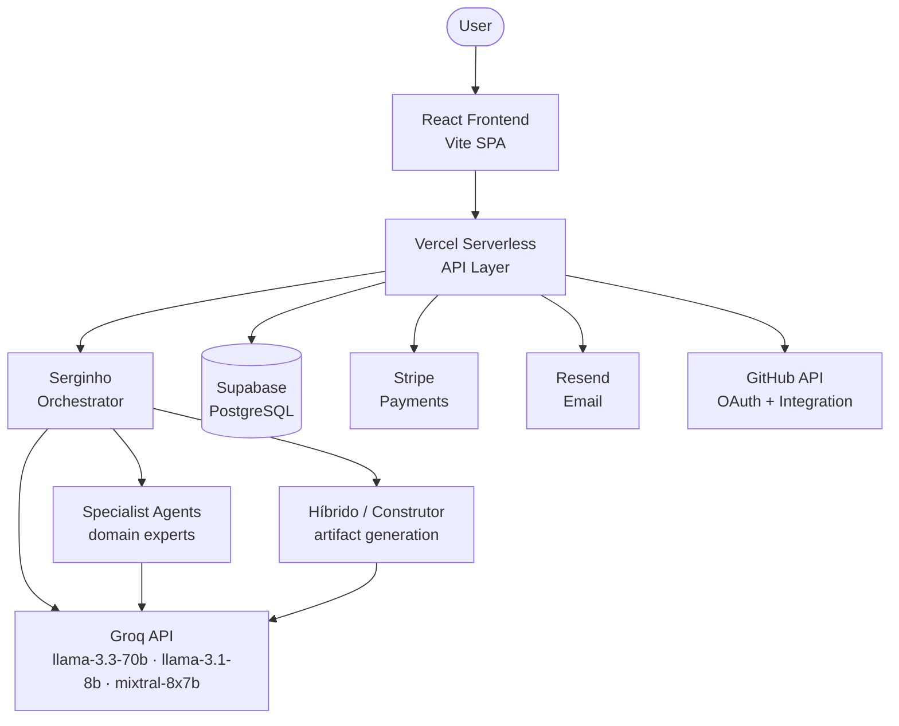

[](https://github.com/kizirianmax/rkmmax-hibrido/actions)
[](LICENSE)
[](.nvmrc)
[](https://coderabbit.ai/gh/kizirianmax/rkmmax-hibrido)

# RKMMAX Híbrido

RKMMAX Híbrido is an AI agent orchestration system with a React frontend and Vercel serverless backend. The sole AI provider is the **Groq API**, which drives a cascade of LLM models to handle requests of varying complexity. The system is organized around three conceptual layers: **Serginho** (sovereign orchestrator), **Specialists** (domain experts), and **Híbrido/Construtor** (artifact generation and hybrid interaction).

> **Development policy:** This is an individual project by [@kizirianmax](https://github.com/kizirianmax). All merges to `main` require a passing CI run. See [DEVELOPMENT_GUIDELINES.md](DEVELOPMENT_GUIDELINES.md) for details.

---

## Architecture Overview

The system is structured in three layers:

| Layer | Component | Role |
|-------|-----------|------|
| **Orchestration** | Serginho | Sovereign orchestrator — routes requests, maintains context, delegates to specialists |
| **Domain expertise** | Specialist Agents | 47 domain specialists across 9 categories, each with a focused capability set |
| **Artifact generation** | Híbrido / Construtor | Handles artifact construction, hybrid chat, and multi-step generation tasks |

**AI provider:** Groq API is the sole active AI runtime. The orchestrator uses a model cascade within Groq:
`llama-3.3-70b-versatile` (complex tasks) → `llama-3.1-8b-instant` (simple/fast tasks) → `mixtral-8x7b-32768` (fallback)


```mermaid
graph TD
    User([User]) --> Frontend[React Frontend<br/>Vite SPA]
    Frontend --> API[Vercel Serverless<br/>API Layer]

    API --> Serginho[Serginho<br/>Orchestrator]
    Serginho --> Specialists[Specialist Agents<br/>domain experts]
    Serginho --> Hibrido[Híbrido / Construtor<br/>artifact generation]

    Serginho --> Groq[Groq API<br/>llama-3.3-70b · llama-3.1-8b · mixtral-8x7b]
    Specialists --> Groq
    Hibrido --> Groq

    API --> Supabase[(Supabase<br/>PostgreSQL)]
    API --> Stripe[Stripe<br/>Payments]
    API --> Resend[Resend<br/>Email]
    API --> GitHub[GitHub API<br/>OAuth + Integration]
```

**Cross-cutting concerns:**
- **Circuit Breaker** — protects against serverless timeout cascades (8 s hard limit, 4 s margin within Vercel's 12 s cap)
- **Security validation** — input sanitization and output filtering on every AI call
- **Intelligent cache** — reduces redundant Groq calls for repeated prompts
- **Observability** — Sentry (errors) + PostHog (analytics) + `/api/health` endpoint

For a detailed architectural breakdown, see [docs/architecture.md](docs/architecture.md).

---

## Specialist Agents

The system registers **47 domain specialists** across 9 categories. The canonical source of truth is `src/config/specialists.js`, which is the only file read by both the backend (`api/ai.js`) and the frontend at runtime.

| Category | Specialists |
|----------|-------------|
| `business` | Biz, Cash, Sales, Mark, Law, PM, HR |
| `creative` | Orac, Zen, Vox, Art, Beat, Film, Lens, Write, Game |
| `education` | Didak, Edu, Mentor |
| `engineering` | Mech, Elec, Civil |
| `languages` | Poly, Eng, Span |
| `lifestyle` | Trip, Home, Style, Eco, Med |
| `science` | Bio, Chem, Phys, Math, Astro |
| `tech` | Code, Nexus, Synth, Sec, Data, UX, Mobile |
| `wellness` | Emo, Focus, Fit, Chef, Coach |

> **Note:** `src/agents/specialists/specialists-config.json` is a legacy stub kept for historical reference and is not imported by any active code path.

---

## Tech Stack

| Layer | Technology |
|-------|-----------|
| Frontend | React 18.3.1, Vite, React Router |
| Backend | Vercel Serverless Functions, Node.js 22.x |
| AI | Groq API (model cascade within Groq — sole active provider) |
| Database | Supabase (PostgreSQL) |
| Payments | Stripe |
| Email | Resend |
| Auth | GitHub OAuth |
| CI/CD | GitHub Actions + Jest |
| Observability | Sentry, PostHog |

---

## Quick Start

### 1. Clone & install

```bash
git clone https://github.com/kizirianmax/rkmmax-hibrido.git
cd rkmmax-hibrido
npm install
```

### 2. Configure environment

```bash
cp .env.example .env
# Minimum required keys:
# GROQ_API_KEY           — Sole active AI provider (mandatory)
# REACT_APP_SUPABASE_URL & REACT_APP_SUPABASE_ANON_KEY
# SUPABASE_SERVICE_ROLE_KEY
# STRIPE_SECRET_KEY & STRIPE_WEBHOOK_SECRET
# GITHUB_OAUTH_CLIENT_ID & GITHUB_OAUTH_CLIENT_SECRET
# RESEND_API_KEY
```

### 3. Run locally

```bash
npm start                  # Frontend dev server (http://localhost:5173)
```

To test serverless functions locally, use the Vercel CLI:

```bash
npm i -g vercel
vercel dev                 # Runs frontend + API functions together
```

### 4. Run tests

```bash
npm test                   # Run all tests
npm run test:coverage      # Run tests with coverage report
npm test -- --watch        # Watch mode
npm test -- circuit        # Run a specific suite
```

### 5. Build & deploy

```bash
npm run build              # Production build (Vite)
vercel deploy --prod       # Deploy to Vercel
```

---

## API Endpoints

All endpoints are Vercel serverless functions under `/api/`.

| Endpoint | Method | Purpose |
|----------|--------|---------|
| `/api/health` | GET | System health check |
| `/api/chat` | POST | Main chat interface |
| `/api/ai` | POST | AI abstraction layer (Construtor: `agentType: "hybrid"`, Serginho: `type: "genius"`, Specialists: `type: "specialist"`) |
| `/api/transcribe` | POST | Audio transcription |
| `/api/abnt-extract-url` | POST | ABNT document extraction |
| `/api/study-lab` | POST | Study lab features |
| `/api/checkout` | POST | Stripe checkout session |
| `/api/stripe-webhook` | POST | Stripe webhook handler |
| `/api/github-oauth` | GET | GitHub OAuth callback |
| `/api/github` | GET/POST | GitHub API integration |
| `/api/admin` | POST | Admin operations |

See [docs/api.md](docs/api.md) for complete request/response documentation.

---

## Deployment

RKMMAX Híbrido is designed for Vercel. All serverless functions in `api/` are automatically deployed as Vercel Functions.

### Environment variables (Vercel dashboard)

```bash
# AI — mandatory
GROQ_API_KEY=gsk_...

# Database
REACT_APP_SUPABASE_URL=https://...
REACT_APP_SUPABASE_ANON_KEY=eyJ...
SUPABASE_SERVICE_ROLE_KEY=eyJ...

# Payments
STRIPE_SECRET_KEY_RKMMAX=sk_...
STRIPE_WEBHOOK_SECRET=whsec_...

# Auth
GITHUB_OAUTH_CLIENT_ID=...
GITHUB_OAUTH_CLIENT_SECRET=...
GITHUB_OAUTH_REDIRECT_URI=https://your-domain/api/auth/github/callback

# Email
RESEND_API_KEY=re_...
FROM_EMAIL=noreply@your-domain

# Optional
REACT_APP_SENTRY_DSN=...
REACT_APP_POSTHOG_KEY=...
```

Full variable reference is in `.env.example`. See [docs/deployment.md](docs/deployment.md) for a step-by-step guide.

**Production domain:** https://kizirianmax.site  
**Health check:** `curl https://kizirianmax.site/api/health` — returns `{"status":"ok",...}` when the system is up

---

## Testing

```bash
npm test                   # Run all tests
npm run test:coverage      # Generate coverage report
npm test -- --watch        # Watch mode for development
npm test -- circuit        # Target a specific test suite
```

The test suite covers: circuit breaker, intelligent cache, AI router, security validator, multi-agent system, and cost optimization logic. Run `npm test` to see the current pass count and coverage, which may change as the test suite evolves.

---

## Project Structure

```
rkmmax-hibrido/
├── api/                    # Vercel serverless functions
│   ├── __tests__/          # API-level tests
│   ├── _utils/             # Shared utilities
│   └── lib/                # Circuit breaker, orchestrator, providers
├── src/                    # React application (Vite)
│   ├── agents/             # Agent infrastructure and specialist configs
│   │   ├── core/           # AgentBase, SpecialistFactory, registry
│   │   └── specialists/    # specialists-config.json
│   ├── components/         # Reusable React components
│   ├── pages/              # Page-level components (35 routes)
│   ├── services/           # Frontend service layer
│   └── utils/              # Utility functions
├── docs/                   # Extended documentation
├── public/                 # Static assets
├── .env.example            # Environment variable reference
├── vercel.json             # Vercel deployment configuration
└── vite.config.js          # Vite build configuration
```

---

## Documentation

- [docs/README.md](docs/README.md) — Documentation index
- [docs/architecture.md](docs/architecture.md) — Architecture deep-dive
- [docs/api.md](docs/api.md) — API reference
- [docs/deployment.md](docs/deployment.md) — Deployment guide
- [docs/AGENTS.md](docs/AGENTS.md) — Agent system details
- [docs/OBSERVABILITY.md](docs/OBSERVABILITY.md) — Monitoring and logging
- [DEVELOPMENT_GUIDELINES.md](DEVELOPMENT_GUIDELINES.md) — Governance and contribution rules

---

## Architecture Principles

- **Groq-only runtime:** Groq is the sole active AI provider. No other LLM provider is called at runtime. Legacy packages in `package.json` (`@google/generative-ai`, `openai`) are not part of the active call path.
- **CI-green merges only:** No PR is merged to `main` without a passing CI run. This is a hard rule enforced by convention; branch protection rules require GitHub Pro or a public repository and are not currently active on this private repository.
- **Single-owner governance:** This is an individual project. External contributions are welcome but must pass all tests and comply with [DEVELOPMENT_GUIDELINES.md](DEVELOPMENT_GUIDELINES.md).
- **Serverless-first resilience:** The circuit breaker pattern is the primary mechanism for handling downstream failures within Vercel's timeout constraints.
- **Legacy repo consolidation:** The architecture is fully consolidated in `rkmmax-hibrido`. Legacy repositories (`kizirian-max-site`, `Rkmmax-app`, `kizi-agent`, `rkmmax-specialists`) have been audited and are no longer active structural sources. `kizi-agent` was an original prototype; `rkmmax-specialists` was a standalone dataset snapshot (49 specialists, superseded by the 47-specialist canonical set in `src/config/specialists.js`). Both are formally classified as discontinued, with no structural dependency in the current system.

---

## Contributing

1. Fork the repository
2. Create a feature branch: `git checkout -b feat/your-feature`
3. Commit using Conventional Commits: `git commit -m 'feat: description'`
4. Ensure all tests pass: `npm test`
5. Push and open a Pull Request

All PRs must have a green CI status before merge.

---

## License

MIT — see [LICENSE](LICENSE) for details.

---

## Author

**Max Kizirian** — [@kizirianmax](https://github.com/kizirianmax)
