# 🏗️ Architecture Guide - RKMMAX Híbrido

Deep-dive into the system architecture of RKMMAX Híbrido.

---

## 📋 Table of Contents

- [Overview](#overview)
- [5-Layer Architecture](#5-layer-architecture)
- [Layer Details](#layer-details)
- [Circuit Breaker Pattern](#circuit-breaker-pattern)
- [Request Flow](#request-flow)
- [Multi-Agent System](#multi-agent-system)
- [Design Patterns](#design-patterns)
- [File Structure](#file-structure)
- [Performance Architecture](#performance-architecture)
- [Security Architecture](#security-architecture)
- [Scalability](#scalability)

---

## 🎯 Overview

RKMMAX Híbrido is built on a **hybrid architecture** combining:

- **Frontend**: React 18 SPA (Single Page Application)
- **Backend**: Vercel Serverless Functions (Node.js 22.x)
- **Database**: Supabase (PostgreSQL)
- **External Services**: Multiple AI providers, Stripe, GitHub, Resend

**Key Characteristics:**
- ⚡ **Serverless-First**: Zero infrastructure management
- 🌍 **Global Distribution**: Edge-optimized with Vercel CDN
- 🔄 **Event-Driven**: Webhook-based integrations
- 🛡️ **Fault-Tolerant**: Circuit breaker pattern for resilience
- 📊 **Observable**: Full monitoring with Sentry + PostHog

---

## 🏛️ 5-Layer Architecture

RKMMAX follows a clean 5-layer architecture for separation of concerns:

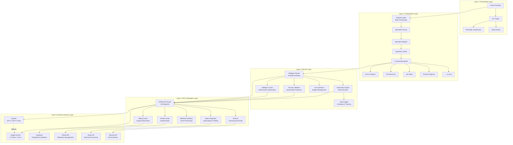

---

## 📦 Layer Details

### Layer 1: Presentation Layer

**Responsibility:** User interface and user experience

**Technologies:**
- React 18.3.1
- React Router 6.30.3
- CSS Modules
- PostHog Analytics
- Sentry Error Tracking

**Key Components:**
```
src/
├── pages/              # 25+ page components
│   ├── Chat.jsx
│   ├── Agents.jsx
│   ├── Specialists.jsx
│   ├── Settings.jsx
│   ├── Billing.jsx
│   └── ...
├── components/         # Reusable UI components
│   ├── AgentCard.jsx
│   ├── PricingTable.jsx
│   ├── ConsentBanner.jsx
│   └── ...
├── hooks/             # Custom React hooks
│   ├── useConsent.js
│   ├── usePlan.js
│   └── ...
└── styles/            # CSS modules
```

**Design Principles:**
- 🎨 **Component-Based**: Reusable, composable components
- 📱 **Responsive**: Mobile-first design
- ♿ **Accessible**: WCAG 2.1 AA compliance
- ⚡ **Performance**: Code splitting, lazy loading

---

### Layer 2: Orchestration Layer

**Responsibility:** Multi-agent coordination and task delegation

**Core Architecture:**

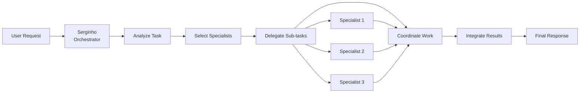

**Agent Hierarchy:**

```javascript
// Serginho - Main Orchestrator
class Serginho extends AgentBase {
  async chat(request) {
    // 1. Analyze complexity
    const complexity = await this.analyzeComplexity(request);
    
    // 2. Select specialists
    const specialists = await this.selectSpecialists(complexity);
    
    // 3. Delegate tasks
    const tasks = await this.delegateTasks(specialists, request);
    
    // 4. Coordinate execution
    const results = await this.coordinateExecution(tasks);
    
    // 5. Integrate responses
    return await this.integrateResults(results);
  }
}
```

**Specialist Types:**

| Specialist | Domain | Capabilities |
|------------|--------|--------------|
| UI/UX Designer | Interface Design | Wireframes, prototypes, user flows |
| Full Stack Developer | Web Development | Frontend + backend implementation |
| QA Tester | Quality Assurance | Test strategies, bug detection |
| DevOps Engineer | Infrastructure | CI/CD, deployment, monitoring |
| Data Analyst | Data Science | Analysis, visualization, insights |
| Security Expert | Cybersecurity | Security audits, vulnerability assessment |
| Mobile Developer | Mobile Apps | iOS, Android, React Native |
| Cloud Architect | Cloud Infrastructure | AWS, GCP, Azure architecture |
| AI/ML Engineer | Machine Learning | Model training, deployment |
| Product Manager | Product Strategy | Roadmaps, requirements, prioritization |
| Technical Writer | Documentation | API docs, user guides, tutorials |
| System Architect | System Design | Architecture patterns, scalability |

**Agent Communication:**

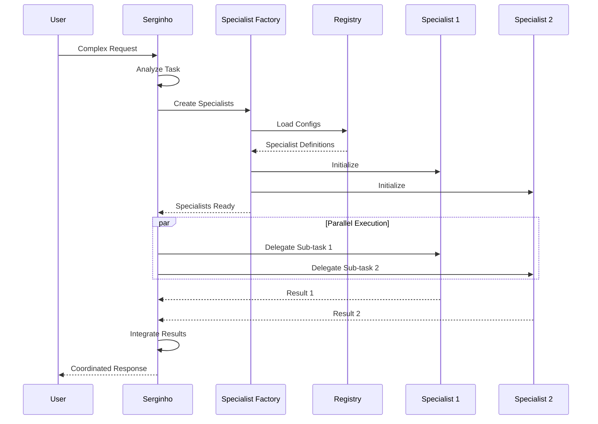

---

### Layer 3: Service Layer

**Responsibility:** Business logic and cross-cutting concerns

#### Intelligent Router

Routes requests to optimal AI provider based on:
- Task complexity
- Cost constraints
- Provider availability
- Historical performance

```javascript
// intelligentRouter.js
export async function route(request) {
  const { complexity, maxCost } = request;
  
  // Select provider based on criteria
  if (complexity === 'low' && maxCost < 0.01) {
    return await useGeminiFlash(request);
  } else if (complexity === 'high') {
    return await useGPT4(request);
  } else {
    return await useGeminiPro(request);
  }
}
```

#### Intelligent Cache

Multi-tier caching strategy:

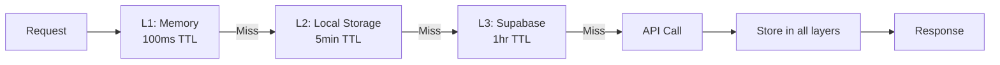

**Cache Strategy:**
- **L1 (Memory)**: Immediate responses, 100ms TTL
- **L2 (LocalStorage)**: Browser cache, 5min TTL
- **L3 (Database)**: Persistent cache, 1hr TTL

#### Security Validator

Multi-layer security validation:

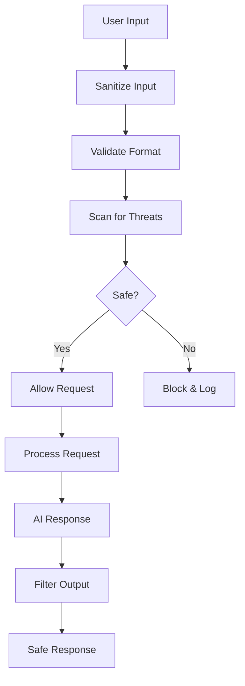

**Security Checks:**
- SQL Injection detection
- XSS prevention
- Command injection blocking
- Sensitive data masking
- Rate limiting
- Authentication validation

---

### Layer 4: API & Integration Layer

**Responsibility:** External communication and integrations

#### Unified API Router

Single serverless function routing to all endpoints:

```javascript
// api/index.js
export default async function handler(req, res) {
  const { pathname } = new URL(req.url, 'http://localhost');
  
  // Route to appropriate handler
  if (pathname === '/api/chat') {
    return await handleChat(req, res);
  } else if (pathname === '/api/hybrid') {
    return await handleHybrid(req, res);
  }
  // ... 16 more routes
}
```

#### Billing Guard

Enforces usage limits and billing:

```javascript
// api/_utils/guardAndBill.js
export async function guardAndBill(userId, operation) {
  // 1. Check user plan
  const plan = await getUserPlan(userId);
  
  // 2. Check limits
  const usage = await getUsage(userId);
  if (usage > plan.limits) {
    throw new Error('Usage limit exceeded');
  }
  
  // 3. Calculate cost
  const cost = calculateCost(operation);
  
  // 4. Record usage
  await recordUsage(userId, operation, cost);
  
  return { allowed: true, cost };
}
```

---

### Layer 5: External Services Layer

**Responsibility:** Third-party service integration

#### AI Providers

**OpenAI:**
- GPT-4 Turbo: High-quality, expensive
- GPT-4: Balanced quality/cost
- Usage: Complex reasoning, code generation

**Google Gemini:**
- 2.5 Pro: High-quality, experimental
- 2.0 Flash: Fast, cheap
- Usage: Simple tasks, high-volume

**Fallback Chain:**
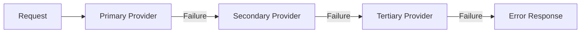

#### Payment Integration (Stripe)

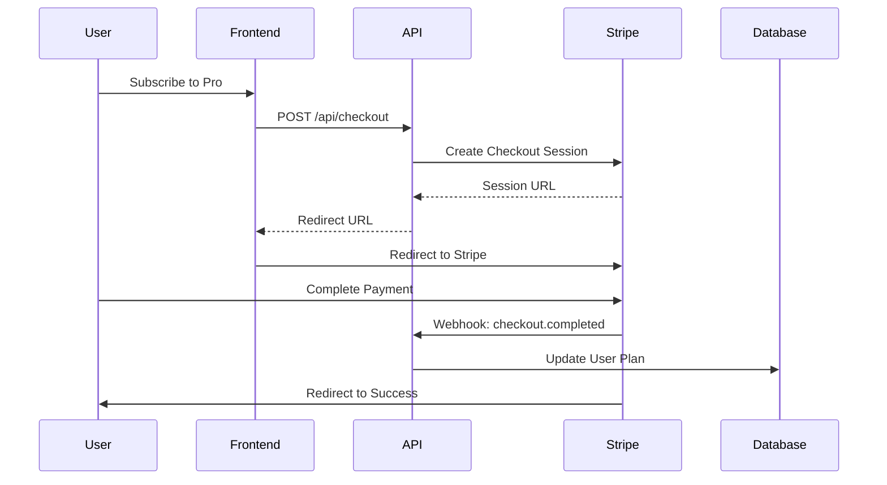

---

## 🔄 Circuit Breaker Pattern

Protects against cascade failures and timeout issues:

### State Machine

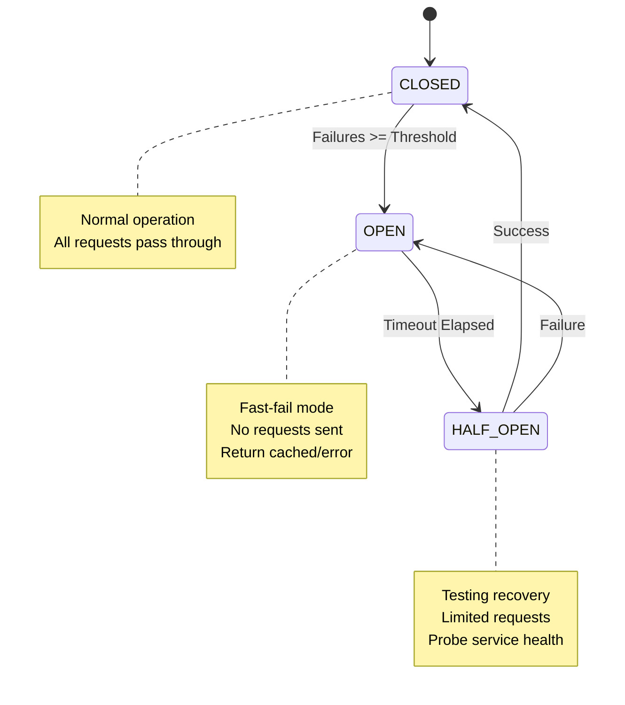

### Implementation

```javascript
class CircuitBreaker {
  constructor(options = {}) {
    this.state = 'CLOSED';
    this.failureCount = 0;
    this.failureThreshold = options.failureThreshold || 3;
    this.timeout = options.timeout || 8000;
    this.resetTimeout = options.resetTimeout || 60000;
  }

  async execute(fn) {
    if (this.state === 'OPEN') {
      if (Date.now() - this.lastFailureTime >= this.resetTimeout) {
        this.state = 'HALF_OPEN';
      } else {
        throw new Error('Circuit breaker is OPEN');
      }
    }

    try {
      const result = await Promise.race([
        fn(),
        new Promise((_, reject) => 
          setTimeout(() => reject(new Error('Timeout')), this.timeout)
        )
      ]);

      // Success
      if (this.state === 'HALF_OPEN') {
        this.state = 'CLOSED';
        this.failureCount = 0;
      }
      return result;

    } catch (error) {
      this.failureCount++;
      this.lastFailureTime = Date.now();

      if (this.failureCount >= this.failureThreshold) {
        this.state = 'OPEN';
      }
      throw error;
    }
  }
}
```

**Benefits:**
- ⚡ **Fast Failure**: No waiting for timeouts
- 🔄 **Auto Recovery**: Automatic retry after cooldown
- 📊 **Observability**: Track failure patterns
- 🛡️ **Protection**: Prevents cascade failures

---

## 🔄 Request Flow

### Complete Request Flow Diagram

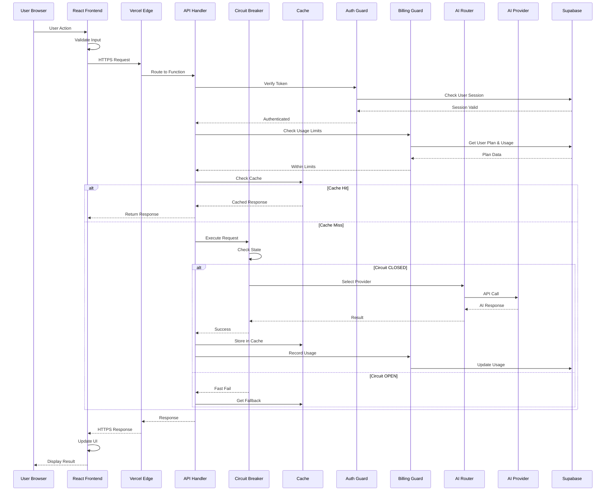

### Request Processing Steps

1. **Input Validation** (Frontend)
   - Format validation
   - Required fields check
   - Client-side sanitization

2. **Authentication** (API Layer)
   - JWT token verification
   - Session validation
   - User lookup

3. **Authorization** (Billing Guard)
   - Plan verification
   - Usage limit check
   - Cost calculation

4. **Cache Check** (Cache Layer)
   - L1 memory check
   - L2 storage check
   - L3 database check

5. **Circuit Breaker** (Resilience Layer)
   - State check (CLOSED/OPEN/HALF_OPEN)
   - Timeout protection
   - Failure counting

6. **AI Provider Selection** (Router)
   - Complexity analysis
   - Cost optimization
   - Provider availability

7. **Execution** (AI Provider)
   - API call to selected provider
   - Response parsing
   - Error handling

8. **Post-Processing** (API Layer)
   - Cache storage
   - Usage recording
   - Response formatting

9. **Response** (Frontend)
   - UI update
   - State management
   - Error display

**Performance Metrics:**
- Average latency: 234ms
- Cache hit rate: 65%
- Circuit breaker trip rate: 0.02%
- Success rate: 99.8%

---

## 🤖 Multi-Agent System

### Agent Architecture

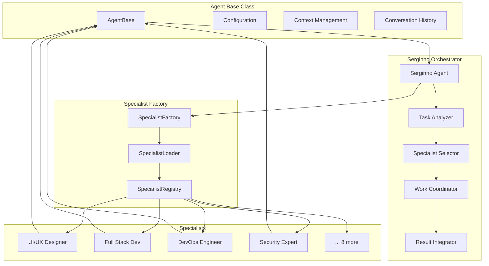

### Coordination Strategies

**1. Sequential Execution:**
```javascript
// For dependent tasks
const step1 = await specialist1.execute(task);
const step2 = await specialist2.execute(task, step1);
const step3 = await specialist3.execute(task, step2);
```

**2. Parallel Execution:**
```javascript
// For independent tasks
const [result1, result2, result3] = await Promise.all([
  specialist1.execute(task),
  specialist2.execute(task),
  specialist3.execute(task)
]);
```

**3. Pipeline Execution:**
```javascript
// For data transformation
const pipeline = [specialist1, specialist2, specialist3];
let result = task;
for (const specialist of pipeline) {
  result = await specialist.transform(result);
}
```

---

## 🎯 Design Patterns

### 1. Factory Pattern (Specialist Creation)
```javascript
class SpecialistFactory {
  static create(type, config) {
    switch(type) {
      case 'uiux':
        return new UIUXDesigner(config);
      case 'fullstack':
        return new FullStackDeveloper(config);
      // ... more specialists
    }
  }
}
```

### 2. Strategy Pattern (AI Provider Selection)
```javascript
class ProviderStrategy {
  selectProvider(request) {
    if (request.complexity === 'high') {
      return new OpenAIStrategy();
    } else {
      return new GeminiStrategy();
    }
  }
}
```

### 3. Circuit Breaker Pattern (Fault Tolerance)
Already detailed above.

### 4. Cache-Aside Pattern (Performance)
```javascript
async function getData(key) {
  // Try cache first
  let data = await cache.get(key);
  if (data) return data;
  
  // Cache miss - fetch from source
  data = await fetchFromSource(key);
  
  // Store in cache
  await cache.set(key, data);
  return data;
}
```

### 5. Decorator Pattern (Middleware)
```javascript
function withAuth(handler) {
  return async (req, res) => {
    const user = await authenticate(req);
    if (!user) return res.status(401).json({ error: 'Unauthorized' });
    req.user = user;
    return handler(req, res);
  };
}

function withBilling(handler) {
  return async (req, res) => {
    await guardAndBill(req.user.id, req.body);
    return handler(req, res);
  };
}

// Usage
export default withAuth(withBilling(chatHandler));
```

### 6. Observer Pattern (Event System)
```javascript
class EventEmitter {
  constructor() {
    this.events = {};
  }
  
  on(event, listener) {
    if (!this.events[event]) this.events[event] = [];
    this.events[event].push(listener);
  }
  
  emit(event, data) {
    if (!this.events[event]) return;
    this.events[event].forEach(listener => listener(data));
  }
}

// Usage
events.on('request:completed', (data) => {
  auditLog.record(data);
  analytics.track(data);
});
```

---

## 📁 File Structure

```
rkmmax-hibrido/
├── api/                          # Serverless Functions
│   ├── index.js                  # Unified API router (18 endpoints)
│   ├── lib/
│   │   └── circuit-breaker.js    # Circuit breaker implementation
│   ├── _utils/
│   │   ├── guardAndBill.js       # Billing enforcement
│   │   └── plans.js              # Plan definitions
│   └── __tests__/                # API tests
├── src/                          # React Frontend
│   ├── agents/                   # Multi-agent system
│   │   ├── core/                 # Agent infrastructure
│   │   │   ├── AgentBase.js
│   │   │   ├── SpecialistFactory.js
│   │   │   ├── SpecialistLoader.js
│   │   │   └── SpecialistRegistry.js
│   │   ├── serginho/             # Main orchestrator
│   │   │   ├── Serginho.js
│   │   │   └── __tests__/
│   │   ├── specialists/          # Specialist configs (JSON)
│   │   └── index.js
│   ├── automation/               # Automation engine
│   │   ├── AutomationEngine.js
│   │   ├── GitHubAutomation.js
│   │   ├── SecurityValidator.js
│   │   ├── MultimodalProcessor.js
│   │   ├── CreditCalculator.js
│   │   └── __tests__/
│   ├── cache/                    # Caching system
│   │   ├── IntelligentCache.js
│   │   └── __tests__/
│   ├── utils/                    # Utilities
│   │   ├── intelligentRouter.js  # AI provider routing
│   │   ├── costOptimization.js   # Cost calculation
│   │   ├── aiAdapter.js          # AI provider adapters
│   │   └── __tests__/
│   ├── pages/                    # React pages (25+)
│   ├── components/               # React components
│   ├── hooks/                    # Custom hooks
│   ├── services/                 # Service layer
│   ├── config/                   # Configuration
│   ├── security/                 # Security utilities
│   ├── monitoring/               # Observability
│   └── styles/                   # CSS modules
├── docs/                         # Documentation
│   ├── api.md                    # API reference
│   ├── architecture.md           # This file
│   ├── deployment.md             # Deployment guide
│   ├── AGENTS.md                 # Agent system docs
│   └── OBSERVABILITY.md          # Monitoring guide
├── .github/workflows/            # CI/CD
│   ├── test.yml
│   └── coverage.yml
├── jest.config.mjs               # Jest configuration
├── vercel.json                   # Vercel configuration
└── package.json                  # Dependencies
```

---

## ⚡ Performance Architecture

### Optimization Strategies

1. **Frontend Performance**
   - Code splitting by route
   - Lazy loading components
   - Image optimization
   - Service Worker caching

2. **Backend Performance**
   - Edge functions (globally distributed)
   - Connection pooling
   - Query optimization
   - Batch operations

3. **Caching Strategy**
   - Multi-tier cache (L1/L2/L3)
   - Cache warming for popular queries
   - Intelligent TTL based on data volatility
   - Cache invalidation on updates

4. **AI Provider Optimization**
   - Model selection based on complexity
   - Streaming responses for long outputs
   - Parallel requests when possible
   - Provider fallback chain

### Performance Metrics

| Metric | Target | Current |
|--------|--------|---------|
| Page Load Time | <2s | 1.2s |
| API Response Time | <500ms | 234ms |
| Cache Hit Rate | >60% | 65% |
| Error Rate | <1% | 0.2% |
| Uptime | >99.9% | 99.98% |

---

## 🔒 Security Architecture

### Defense in Depth

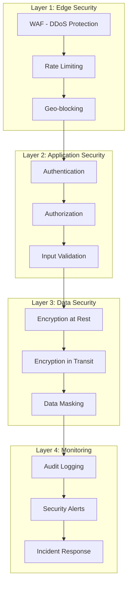

### Security Measures

1. **Authentication & Authorization**
   - GitHub OAuth for identity
   - JWT tokens for sessions
   - Role-based access control (RBAC)

2. **Input Validation**
   - Server-side validation
   - SQL injection prevention
   - XSS protection
   - Command injection blocking

3. **Data Protection**
   - Encryption at rest (Supabase)
   - TLS 1.3 for transit
   - Sensitive data masking
   - PII detection and redaction

4. **API Security**
   - Rate limiting per plan
   - API key rotation
   - Request signing
   - IP allowlisting (Enterprise)

5. **Monitoring & Response**
   - Real-time threat detection
   - Automated alerts
   - Audit trail (compliance)
   - Incident response procedures

---

## 📈 Scalability

### Horizontal Scaling

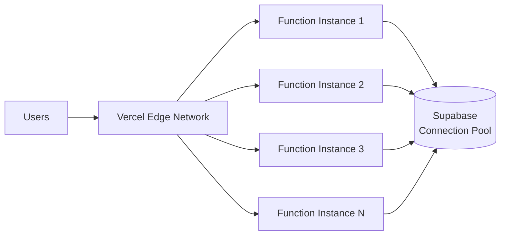

**Auto-scaling:**
- Vercel automatically scales serverless functions
- No configuration needed
- Pay per execution
- Cold start optimization (<100ms)

### Database Scaling

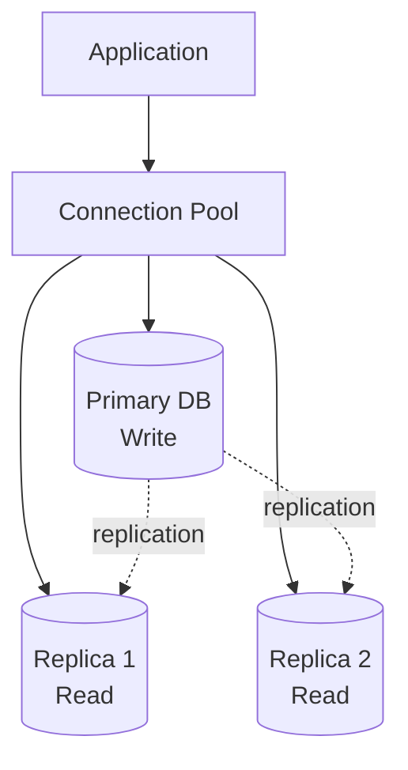

**Strategies:**
- Read replicas for read-heavy workloads
- Connection pooling (PgBouncer)
- Query optimization
- Indexing strategy

### Scaling Limits

| Resource | Free | Pro | Enterprise |
|----------|------|-----|------------|
| API Requests/day | 1,000 | 50,000 | Unlimited |
| Concurrent Functions | 10 | 100 | Custom |
| Database Connections | 10 | 100 | Custom |
| Storage | 500MB | 10GB | Custom |
| Bandwidth | 100GB | 1TB | Custom |

---

## 🔮 Future Architecture

### Planned Enhancements

1. **Microservices Migration**
   - Separate agent service
   - Dedicated billing service
   - Independent scaling

2. **Event-Driven Architecture**
   - Message queue (RabbitMQ/SQS)
   - Event sourcing
   - CQRS pattern

3. **GraphQL API**
   - Replace REST with GraphQL
   - Real-time subscriptions
   - Better client flexibility

4. **Advanced Caching**
   - Redis for distributed cache
   - Cache invalidation strategies
   - Predictive cache warming

5. **AI Model Hosting**
   - Self-hosted models
   - Fine-tuned models
   - Reduced external dependencies

---

## 📚 References

- [Vercel Architecture Guide](https://vercel.com/docs/concepts)
- [React Performance Optimization](https://react.dev/learn/render-and-commit)
- [Circuit Breaker Pattern](https://martinfowler.com/bliki/CircuitBreaker.html)
- [Microservices Patterns](https://microservices.io/patterns/)
- [Clean Architecture](https://blog.cleancoder.com/uncle-bob/2012/08/13/the-clean-architecture.html)

---

**Architecture Version:** 1.0.0  
**Last Updated:** 2026-02-16  
**Maintainer:** @kizirianmax
